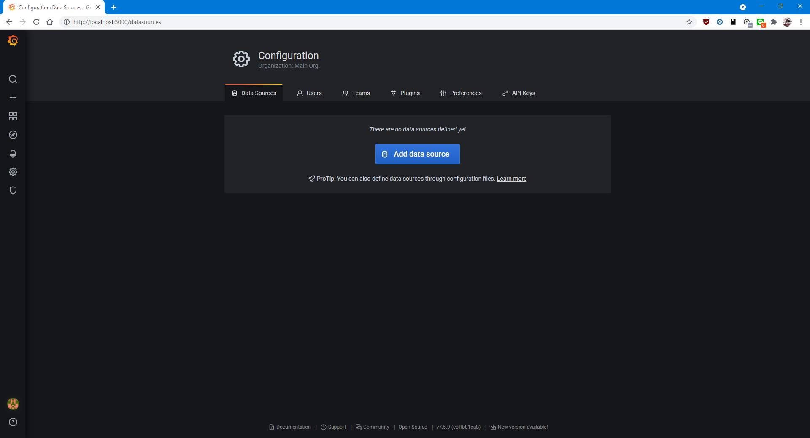
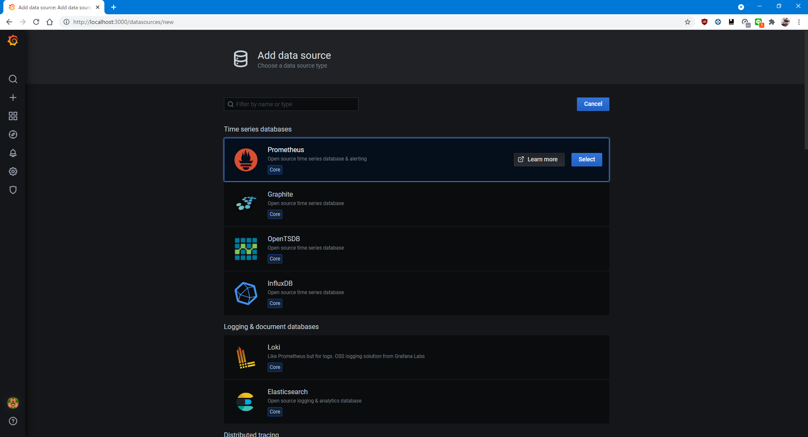
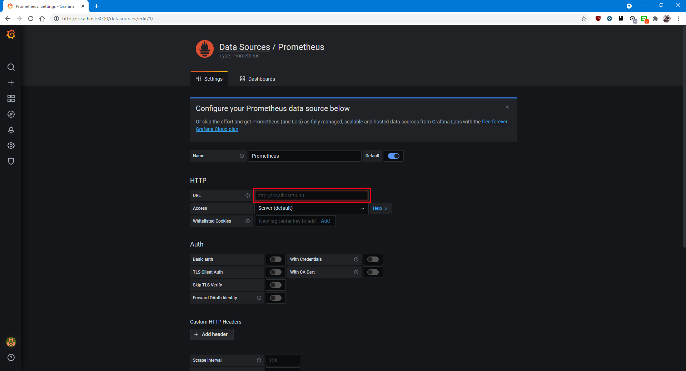
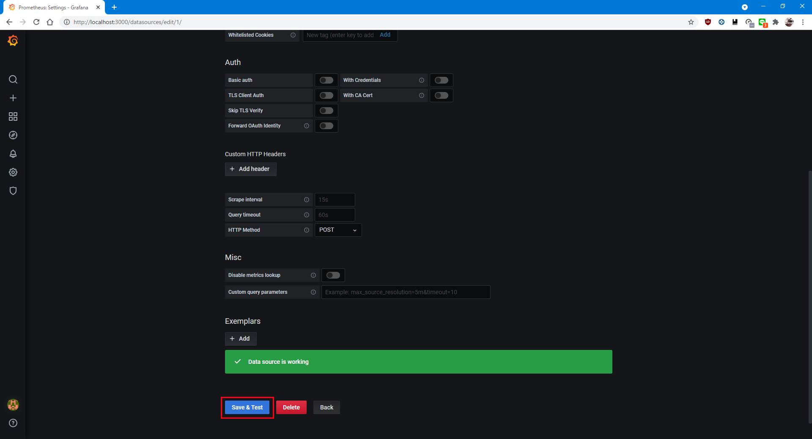
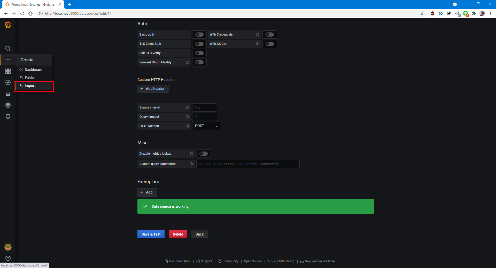
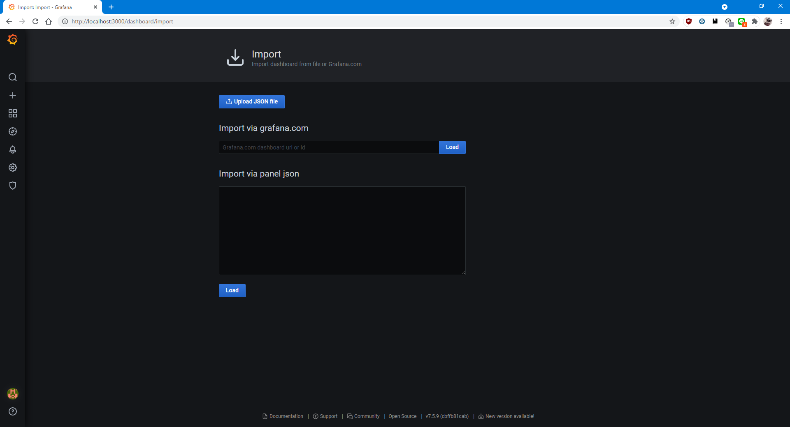
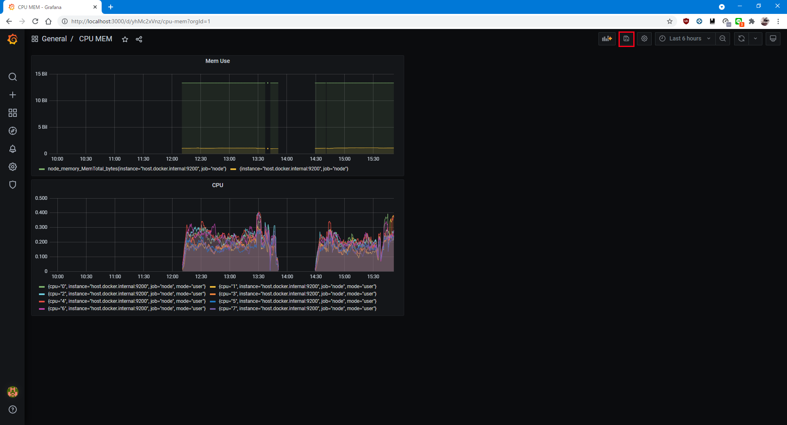

# 技術研究対策　成果物その2
## 注意：dockerが入っていることが前提となります
## また、成果物その1のサーバーを利用するのでまだの方は先にそちらを実行してください
***

- ボリュームの作成
```
docker volume create metrics_data
docker volume create grafana_data
```

- 起動
```
docker-compose up -d --build
```
***
### Grafanaの設定

[localhost:3000](localhost:3000)にアクセス

ログインページが現れるのでadmin:adminでログイン

パスワードの再設定は自由に

- DataSourceの追加

以下の赤枠のData Sourcesをクリック


Add data sourceをクリック


Prometheusをクリック


赤枠の部分に
```
host.docker.internal:9090
```
と入力


下の赤枠のSave & Testを押してData Source is workingが表示されれば完了


- グラフ作成

次に左のプラスマークから赤枠のimportをクリック


```
grafana/dashboards/board.json
```
の中身をImport via panel jsonに入力してLoadをクリック


NameとFolderはご自由に、Importをクリックして完了


右上の赤枠のフロッピーマークを押してSaveをクリック


DashBoardsから保存したものは呼び出せる
***
### Parrot Security OS
- 中に入る

```
docker exec -it parrotsec bash
```
で接続完了、抜ける際は
```
exit
```

- 疎通確認

上記にある中に入るコマンドでParrot OSの中に入ってください
```
curl localhost:80
```
でindex.htmlの中身が表示されれば正常に疎通出来ている

- SYN Flood攻撃を行う

**注意:この手法は本当の攻撃になりうるので自分のサーバー等のみに限って行ってください**

```
hping3 -i u1000 -S -p 80 localhost --rand-source
```

攻撃を終えるには Ctrl + C を押してください

なおDockerでコンテナを分けているためなのかNginxのデフォルトが有能なのかはわかりませんがこの攻撃は弾かれます

***
- 停止
```
docker-compose down
```